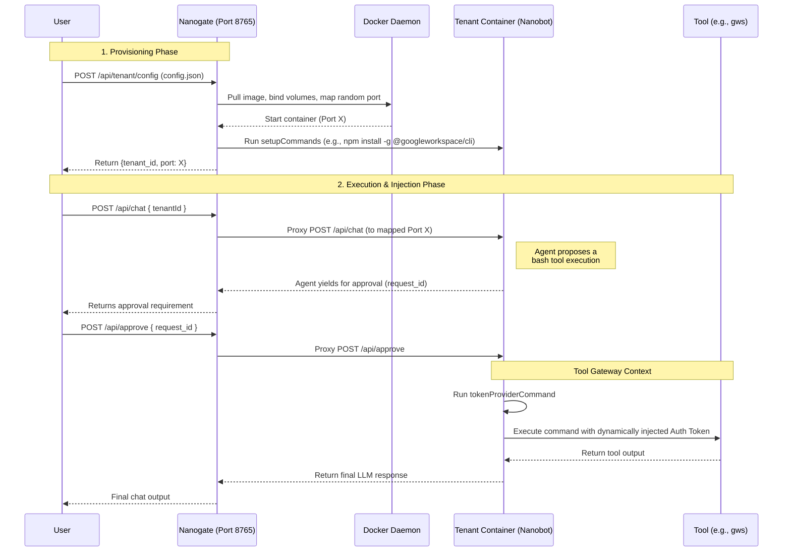

# nanogate

A multi-tenant API Gateway and Docker orchestrator for the [nanobot](https://github.com/HKUDS/nanobot) framework.

`nanogate` acts as a reverse proxy and isolation layer, spinning up dedicated Docker containers for individual AI agent tenants on-demand. It handles dynamic CLI injections, environment variable mapping, and request proxying.

## Architecture

`nanogate` fundamentally changes how `nanobot` operates in production environments:
1. **API Gateway**: Exposes endpoints (`/api/tenant/config`, `/api/chat`, `/api/approve`) to manage tenant sessions dynamically.
2. **Container Provisioning**: Translates tenant JSON configs into isolated Docker containers running the `hkuds/nanobot:latest` image.
3. **Dynamic Setup**: Mounts local script directories and seamlessly installs global packages (`npm`, `pip`, `apt`) dynamically via the `setupCommands` array before unblocking traffic.
4. **Proxy**: Forwards `/chat` and human-in-the-loop `/approve` traffic specifically to the mapped ports of the containerized LLMs.
5. **Tool Gateway**: Dynamically injects ephemeral/OAuth credentials into containerized agent tools (like `gws` or `mcq`) immediately before execution, ensuring the agent itself never sees or accidentally leaks the token.

### Request Flow



## Installation

```bash
git clone <this-repo> nanogate
cd nanogate
uv venv
source .venv/bin/activate
uv pip install -e .
```

## Running the Server

Start the orchestration server locally on port `8765`:

```bash
uv run -m gateway.server
```

## Usage

### 1. Provision a Tenant
Inject Docker orchestration commands, custom environment variables, and the Nanobot configuration payload.

Use `gateway.scriptsDir` to mount your own scripts directory into the container at `/app/tenant_scripts`. This allows each tenant to bring their own token providers and helper scripts without modifying the `nanogate` package itself.

```bash
curl -X POST http://localhost:8765/api/tenant/config \
 -H "Content-Type: application/json" \
 -d '{
  "tenant_id": "tenant-xyz",
  "config": {
    "gateway": {
      "scriptsDir": "/path/to/my/scripts",
      "setupCommands": ["npm install -g @googleworkspace/cli"],
      "env": {
        "GOOGLE_WORKSPACE_CLI_CREDENTIALS_FILE": "/app/tenant_scripts/client_secret.json"
      }
    },
    "tools": {
      "toolGateway": {
        "enabled": true,
        "tokenProviderCommand": "python /app/tenant_scripts/mint_gmail_token.py",
        "requireApprovalForApi": true
      }
    },
    "agents": { ... },
    "providers": { ... }
  }
}'
```

> **Note:** A full sample config is available at [`sample/tenant_config.json`](sample/tenant_config.json).

### 2. Initiate Chat

```bash
curl -X POST http://localhost:8765/api/chat \
  -H "Content-Type: application/json" \
  -d '{
  "tenantId": "tenant-xyz",
  "sessionId": "session-1",
  "message": "Send test email to user@example.com"
}'
```

### 3. Approve Executions (Human-in-the-loop)

```bash
curl -X POST http://localhost:8765/api/approve \
  -H "Content-Type: application/json" \
  -d '{
  "tenantId": "tenant-xyz",
  "sessionId": "session-1",
  "request_id": "uuid-from-chat-response",
  "autoResume": true
}'
```

## Requirements
- Python 3.11+
- Docker Engine executing on host machine
