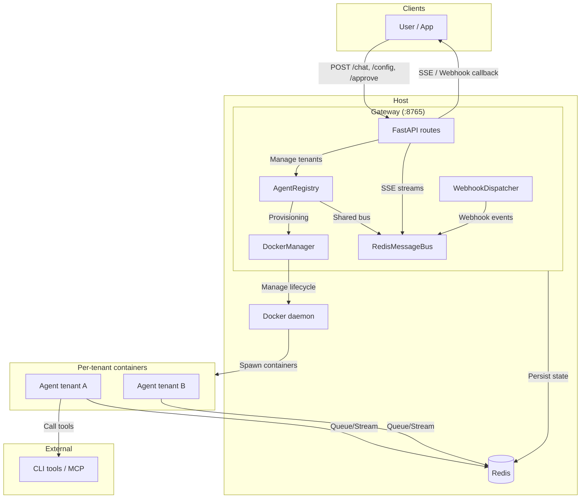
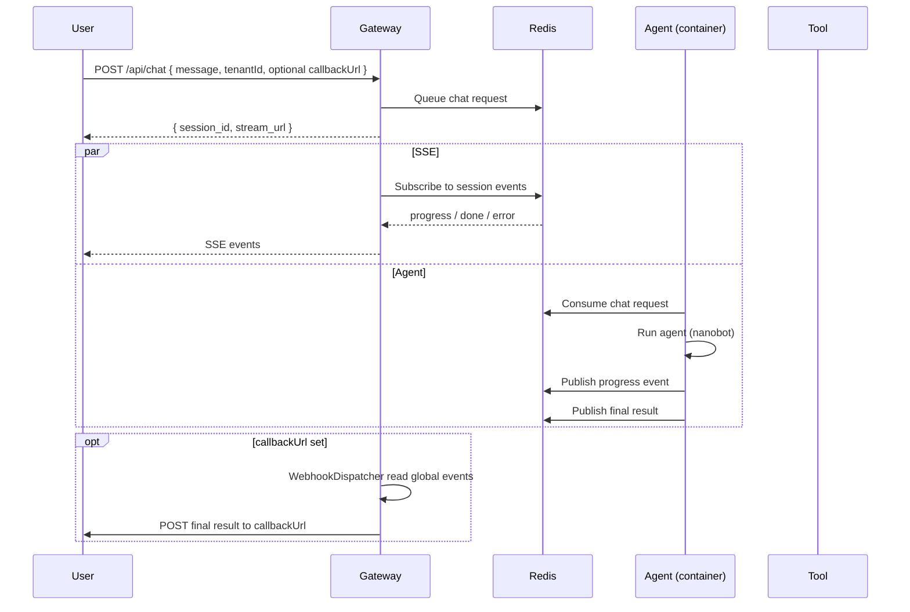

# nanogate

A multi-tenant API Gateway and Docker orchestrator for the [nanobot](https://github.com/HKUDS/nanobot) framework.

Nanogate spins up dedicated Docker containers per tenant, routes chat through a Redis message bus for real-time and offline delivery, and proxies approval and tenant-specific APIs to the right container.

## Architecture

### Overview

| Component | Role | Runs on |
|----------|------|--------|
| **Gateway** | API entrypoint, tenant provisioning, Redis bus client, webhook dispatcher, approval proxy | Host (port 8765) |
| **Redis** | Message bus: request queues and event streams for chat | Host (e.g. localhost:6379) |
| **Agent** | Single-tenant nanobot agent: consumes from Redis, runs LLM/tools, publishes events; handles approval HTTP | One Docker container per tenant |

Clients talk only to the gateway. Chat goes gateway → Redis → agent → Redis → gateway (SSE or callback). Approvals and tenant proxy go gateway → HTTP to the tenant container.

### Architecture diagram



### Components in detail

- **Gateway**
  - **Routes**: `/api/chat`, `/api/chat/async`, `/api/chat/stream/{session_id}`, `/api/approve`, `/api/tenant/config`, `/api/tenant/container/{id}/proxy/{path}`.
  - **DockerManager**: Builds `nanogate:latest`, provisions one container per tenant with mounted config/tools/scripts, runs setup commands, prunes idle containers. **Container state is stored in Redis** (`nanogate:containers:state:{tenant_id}`): before a container is stopped, its config and metadata are saved so the tenant can be resumed on the next request or after a gateway restart.
  - **AgentRegistry**: Maps `tenant_id` → container; holds a shared **RedisMessageBus** and passes Redis URL to DockerManager for state persistence.
  - **RedisMessageBus**: LPUSH chat requests to `nanogate:tenant:{id}:inbound`; XREAD session stream for SSE; consumer group on global stream for webhooks.
  - **WebhookDispatcher**: Background worker that XREADGROUP the global stream and POSTs final (done/error) payloads to `callbackUrl` when present.
- **Redis**
  - **Lists**: `nanogate:tenant:{tenant_id}:inbound` — one queue per tenant.
  - **Streams**: `nanogate:session:{session_id}:outbound` — per-session events (progress, done, error); `nanogate:outbound:all` — global stream for webhook delivery.
  - **Container state**: `nanogate:containers:state:{tenant_id}` — JSON state (tenant_id, container_id, config_data, status running/stopped, last_activity, etc.). This is the **source of truth** for tenant_id → container mapping; gateway uses it to resolve tenants and to resume containers after stop or restart.
  - **Session state**: `nanogate:tenant:{tenant_id}:session_state:{session_key}` — Nanobot session state (conversation history) so conversations can resume when a container comes back up. The agent saves session state to Redis after each turn and loads it before handling a request.
- **Agent (container)**
  - **Bus listener**: BRPOP from tenant inbound → run agent (nanobot) → XADD to session stream (progress) and on done/error to session + global stream. Original payload (e.g. `callbackUrl`) is kept in final event for the dispatcher.
  - **Session persistence**: Before handling a request, loads session state from Redis (if any) into the workspace so nanobot can resume the conversation. After each successful turn, saves session state from the workspace to Redis so conversations survive container restarts.
  - **HTTP**: `/api/approve`, `/api/chat` (optional direct), health; used by the gateway to proxy approvals and optional tenant proxy.

### Key flows

1. **Tenant provisioning**  
   `POST /api/tenant/config` → Gateway creates/updates tenant config, DockerManager builds image if needed, starts container with mounts and env, runs `setupCommands` → container ready. **Tenant_id → container mapping** is stored in Redis (`nanogate:containers:state:{tenant_id}`); gateway resolves tenants from Redis (with in-memory cache).

2. **Chat (real-time)**  
   `POST /api/chat` → Gateway pushes payload to Redis list → returns `session_id`, `stream_url`. Client opens `GET /api/chat/stream/{session_id}` (SSE). Gateway XREADs session stream, agent BRPOPs request, runs agent, XADDs progress/done/error to session stream → client receives SSE. Optional `?last_event_id=` for resume.

3. **Chat (offline callback)**  
   Same as above but client includes `callbackUrl` (or uses `POST /api/chat/async` with required `callbackUrl`). Agent publishes done/error to global stream with `request_payload`; WebhookDispatcher POSTs final result to `callbackUrl`.

4. **Approval**  
   `POST /api/approve` with `tenantId`, `sessionId`, `request_id` → Gateway proxies to `http://localhost:{port}/api/approve` on the tenant container. No Redis; HTTP only.

5. **Tenant proxy**  
   `GET/POST /api/tenant/container/{tenant_id}/proxy/{path}` → Gateway forwards to `http://localhost:{port}/{path}` for that tenant (e.g. pending approvals, internal APIs).

### Chat flow (sequence)



### Environment

- **Gateway**: `NANOGATE_REDIS_URL` (default `redis://localhost:6379`).
- **Agent (container)**: `REDIS_URL` (or `NANOGATE_REDIS_URL`), `TENANT_ID`; gateway passes these when starting the container.

## Installation

```bash
git clone <this-repo> nanogate
cd nanogate
uv venv
source .venv/bin/activate
uv pip install -e .
```

### Build the Docker Image

The gateway auto-builds the image on first tenant provision, or you can build it manually:

```bash
docker build -t nanogate:latest .
```

## Running the Server

Start the gateway server on port `8765`:

```bash
uv run -m gateway.server
```

## Usage

### 1. Provision a Tenant

Use `gateway.toolsDir` to mount your own python `Tool` plugins into `/app/tenant_tools`, and `gateway.scriptsDir` to mount your own execution scripts (token providers, etc.) into the container at `/app/tenant_scripts`:

```bash
curl -X POST http://localhost:8765/api/tenant/config \
 -H "Content-Type: application/json" \
 -d '{
  "tenant_id": "tenant-xyz",
  "config": {
    "gateway": {
      "toolsDir": "/path/to/my/plugins",
      "scriptsDir": "/path/to/my/scripts",
      "setupCommands": ["npm install -g @googleworkspace/cli"],
      "env": {
        "GOOGLE_WORKSPACE_CLI_CREDENTIALS_FILE": "/app/tenant_scripts/client_secret.json"
      }
    },
    "tools": {
      "toolGateway": {
        "enabled": true,
        "tokenProviderCommand": "python /app/tenant_scripts/mint_gmail_token.py",
        "requireApprovalForApi": true
      }
    },
    "agents": { ... },
    "providers": { ... }
  }
}'
```

> See [`sample/tenant_config.json`](sample/tenant_config.json) for a full config example.

### 2. Initiate Chat

**Real-time (SSE):** POST to `/api/chat`, then open the returned `stream_url` for SSE events.

```bash
curl -X POST http://localhost:8765/api/chat \
  -H "Content-Type: application/json" \
  -d '{
  "tenantId": "tenant-xyz",
  "sessionId": "session-1",
  "message": "Send test email to user@example.com"
}'
# Then GET /api/chat/stream/{session_id} for SSE. Use ?last_event_id=<id> to resume.
```

**Offline callback:** Include `callbackUrl`; the gateway will POST the final result there when the run finishes (no progress events, only done/error). Use `POST /api/chat/async` with `callbackUrl` required for the same flow.

### 3. Approve Executions (Human-in-the-loop)

```bash
curl -X POST http://localhost:8765/api/approve \
  -H "Content-Type: application/json" \
  -d '{
  "tenantId": "tenant-xyz",
  "sessionId": "session-1",
  "request_id": "uuid-from-chat-response",
  "autoResume": true
}'
```

## Project Structure

```
nanogate/
├── gateway/                     # Multi-tenant orchestrator (runs on host)
│   ├── server.py                # FastAPI app, lifespan (WebhookDispatcher, default tenant)
│   ├── docker_manager.py        # Docker image build, per-tenant container lifecycle, idle prune
│   ├── registry.py              # AgentRegistry: DockerManager + RedisMessageBus
│   ├── webhook_dispatcher.py    # Consumes global Redis stream, POSTs to callbackUrl
│   └── routes/
│       ├── chat.py              # POST /chat, /chat/async; GET /chat/stream/{id}
│       ├── approval.py          # POST /approve → proxy to tenant container(s)
│       └── tenant.py            # POST /tenant/config; proxy /tenant/container/{id}/proxy/{path}
│
├── nanogate/                    # Shared bus abstraction
│   └── bus.py                   # RedisMessageBus: lists (inbound), streams (session + global), session state get/set
│
├── agent/                       # Single-tenant agent (runs in container)
│   ├── server.py                # FastAPI app, bus listener loop, session load/save, HTTP routes
│   ├── agent_loop.py            # Creates nanobot AgentLoop from config
│   ├── session_persistence.py   # Save/load nanobot session state to Redis for conversation resume
│   ├── context.py               # ACTIVE_SESSION, approval context (contextvars)
│   ├── plugin_loader.py         # Discover custom tools from tenant_tools
│   └── routes/
│       ├── chat.py              # Direct chat (and /chat/async) for backward compat
│       └── approval.py          # POST /approve, pending approvals
│
└── sample/
    ├── tenant_config.json       # Example tenant configuration
    ├── tools/                   # Example custom `Tool` plugins
    └── scripts/                 # Example token provider / scripts
```

## Requirements

- Python 3.11+
- Docker Engine running on host
- Redis (for chat message bus; default `redis://localhost:6379`)

## Running tests

Integration tests need the **gateway** and **Redis** running; they provision a tenant (Docker container) and run chat flows.

1. **Start Redis** (if not already running):
   ```bash
   docker run -d -p 6379:6379 --name nanogate-redis redis:7-alpine
   ```
2. **Start the gateway** (in a separate terminal):
   ```bash
   uv run python -m gateway.server
   ```
   If you see `address already in use` on port 8765, stop the existing process (e.g. `lsof -ti:8765 | xargs kill`) or run one gateway instance only.
3. **API key**: Put a valid `config.providers.openai.apiKey` in `sample/tenant_config.json`, or set `OPENAI_API_KEY` in the environment (gateway will pass it into the container if not in config).
4. **Run tests**:
   ```bash
   uv sync --extra test
   uv run pytest tests/ -v
   ```
   First run can take 1–2 minutes (image build, container start, LLM call). Tests use a 90s timeout per test; if they time out, check that Redis is reachable and the agent container can connect to Redis (`host.docker.internal:6379` on Mac).
