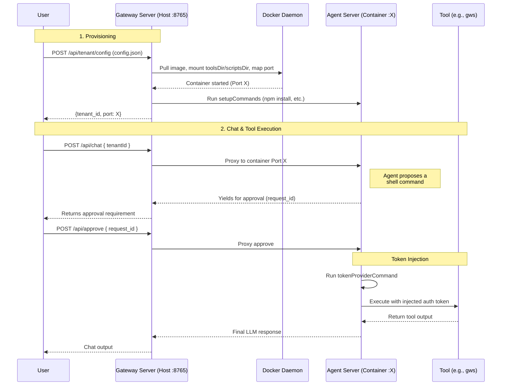

# nanogate

A multi-tenant API Gateway and Docker orchestrator for the [nanobot](https://github.com/HKUDS/nanobot) framework.

`nanogate` acts as a reverse proxy and isolation layer, spinning up dedicated Docker containers for individual AI agent tenants on-demand. It handles dynamic CLI injections, environment variable mapping, and request proxying.

## Architecture

`nanogate` is structured as two packages:

| Package | Role | Runs on |
|---------|------|---------|
| `gateway/` | Multi-tenant orchestrator — provisions containers, proxies requests | Host |
| `agent/` | Single-tenant agent server — one agent loop with chat & tool approval | Docker container |

### Key Capabilities

1. **API Gateway** — Exposes `/api/tenant/config`, `/api/chat`, `/api/approve` for managing tenant sessions.
2. **Container Provisioning** — Translates tenant JSON configs into isolated Docker containers.
3. **Dynamic Setup** — Installs packages via `setupCommands` and mounts tenant custom plugins via `toolsDir` and scripts via `scriptsDir`.
4. **Proxy** — Forwards chat and approval traffic to the correct container.
5. **Tool Gateway** — Injects ephemeral OAuth tokens into tool commands (like `gws`) at execution time.

### Request Flow



## Installation

```bash
git clone <this-repo> nanogate
cd nanogate
uv venv
source .venv/bin/activate
uv pip install -e .
```

### Build the Docker Image

The gateway auto-builds the image on first tenant provision, or you can build it manually:

```bash
docker build -t nanogate:latest .
```

## Running the Server

Start the gateway server on port `8765`:

```bash
uv run -m gateway.server
```

## Usage

### 1. Provision a Tenant

Use `gateway.toolsDir` to mount your own python `Tool` plugins into `/app/tenant_tools`, and `gateway.scriptsDir` to mount your own execution scripts (token providers, etc.) into the container at `/app/tenant_scripts`:

```bash
curl -X POST http://localhost:8765/api/tenant/config \
 -H "Content-Type: application/json" \
 -d '{
  "tenant_id": "tenant-xyz",
  "config": {
    "gateway": {
      "toolsDir": "/path/to/my/plugins",
      "scriptsDir": "/path/to/my/scripts",
      "setupCommands": ["npm install -g @googleworkspace/cli"],
      "env": {
        "GOOGLE_WORKSPACE_CLI_CREDENTIALS_FILE": "/app/tenant_scripts/client_secret.json"
      }
    },
    "tools": {
      "toolGateway": {
        "enabled": true,
        "tokenProviderCommand": "python /app/tenant_scripts/mint_gmail_token.py",
        "requireApprovalForApi": true
      }
    },
    "agents": { ... },
    "providers": { ... }
  }
}'
```

> See [`sample/tenant_config.json`](sample/tenant_config.json) for a full config example.

### 2. Initiate Chat

```bash
curl -X POST http://localhost:8765/api/chat \
  -H "Content-Type: application/json" \
  -d '{
  "tenantId": "tenant-xyz",
  "sessionId": "session-1",
  "message": "Send test email to user@example.com"
}'
```

### 3. Approve Executions (Human-in-the-loop)

```bash
curl -X POST http://localhost:8765/api/approve \
  -H "Content-Type: application/json" \
  -d '{
  "tenantId": "tenant-xyz",
  "sessionId": "session-1",
  "request_id": "uuid-from-chat-response",
  "autoResume": true
}'
```

## Project Structure

```
nanogate/
├── gateway/                  # Multi-tenant orchestrator (runs on host)
│   ├── server.py             # FastAPI gateway app
│   ├── docker_manager.py     # Docker container lifecycle
│   ├── registry.py           # Tenant container registry
│   └── routes/               # Proxy routes (tenant, chat, approval)
│
├── agent/                    # Single-tenant agent (runs in container)
│   ├── server.py             # FastAPI agent app
│   ├── agent_loop.py         # Creates nanobot AgentLoop from config
│   ├── tool_gateway.py       # Approval queue + token injection
│   ├── exec_tool.py          # Wraps exec tool with approval hook
│   └── routes/               # Direct chat & approval handlers
│
└── sample/
    ├── tenant_config.json    # Example tenant configuration
    ├── tools/                # Example custom `Tool` plugins
    └── scripts/              # Example token provider execution scripts
```

## Requirements
- Python 3.11+
- Docker Engine running on host
